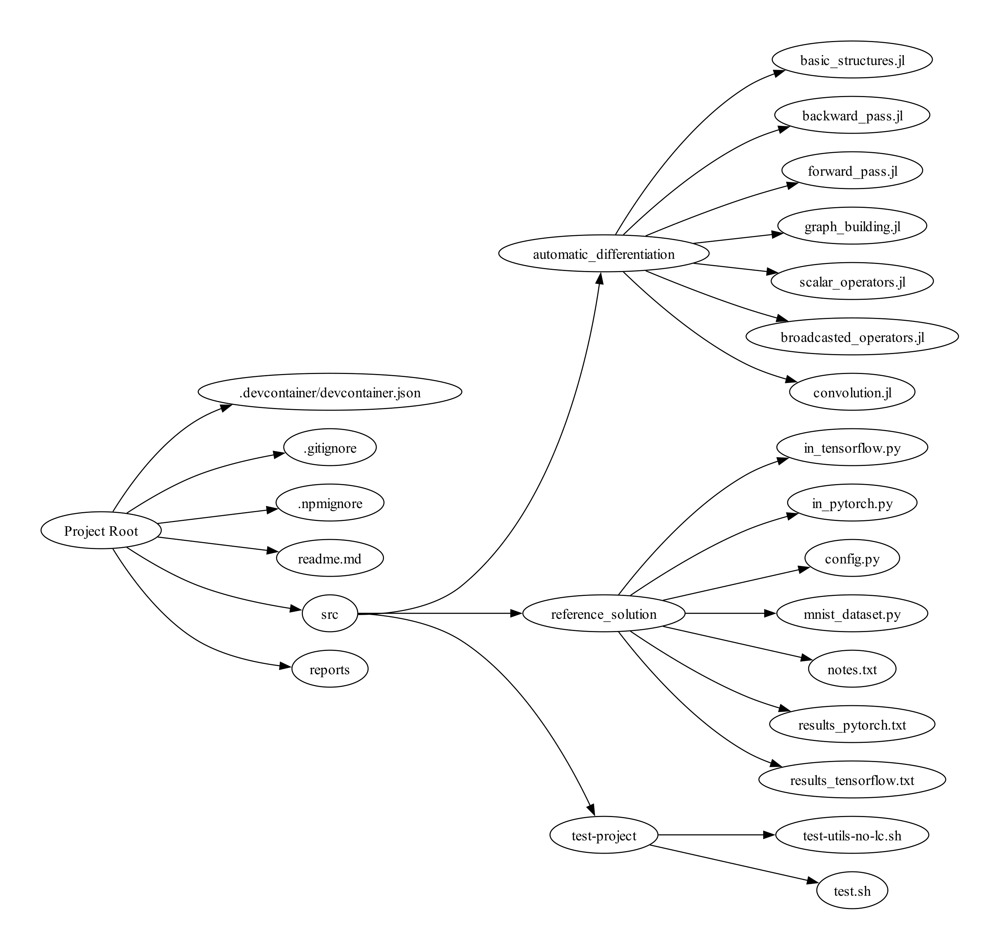
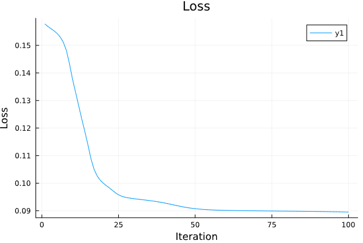

# Efficient Automatic Differentiation for Convolutional Neural Networks in Julia

  

## Table of Contents
- [Introduction](#introduction)
- [Literature Review](#literature-review)
- [State of the Art](#state-of-the-art)
- [Establishing Baseline Training Speeds](#establishing-baseline-training-speeds)
- [Implementation](#implementation)
  - [Structures](#structures)
  - [Building the Graph](#building-the-graph)
  - [Operators](#operators)
  - [Convolution Operation](#convolution-operation)
  - [Training Process](#training-process)
- [Optimization](#optimization)
- [Results](#results)

## Introduction
This repository presents an efficient implementation of automatic differentiation for Convolutional Neural Networks (CNNs) in Julia. The project includes the development of a custom automatic differentiation library and the training of a simple CNN using this library. The implementation is compared against well-known libraries like PyTorch and TensorFlow to evaluate its effectiveness and performance.

## Literature Review
The literature review covers a range of papers on numerical computing, machine learning, and deep learning. Notable mentions include the introduction of Julia, forward-mode automatic differentiation in Julia, and comprehensive overviews of CNNs using popular frameworks like PyTorch and TensorFlow.

## State of the Art
The report document discusses the current state of automatic differentiation techniques for CNNs, focusing on computational graph representation, backpropagation, dynamic computation graphs, and mixed precision training.

## Establishing Baseline Training Speeds
The project conducts experiments to compare the training speeds of TensorFlow and PyTorch when training a CNN model on the MNIST dataset. The baseline results provide a foundation for evaluating the custom Julia implementation.

## Implementation

  

### Structures
The project defines various structures for manipulating a computational graph, including abstract types for graph nodes, operators, constants, variables, scalar operators, and broadcasted operators.

### Building the Graph
A topological sort function is implemented to build a topologically sorted order of the graph. The report document details the logic for visiting nodes and operators during the topological sort.

### Operators
Operators are functions defining mathematical operations and functions for use in a computational graph. The report document provides insights into forward and backward passes for these operators.

### Convolution Operation
Details of the convolution operation are explained, including the forward and backward methods. The document covers padding, stride, and dimension calculations for efficient implementation.

### Training Process
The training process involves building a computation graph, iterating over training iterations, performing learning iterations, saving parameter gradients, calculating loss, and updating parameters.

## Optimization
The report document outlines optimization strategies employed to enhance execution speed, including custom implementations of operations, efficient array operations, and the use of multiple dispatch.

## Results
Training history and performance results are presented, showcasing the training speeds and execution times of the custom Julia implementation. Despite being slower than Python libraries, significant optimizations are achieved.

| Library/Framework | Training Speed (Seconds) |
| ------------------ | ------------------------ |
| TensorFlow        | 10.33                    |
| PyTorch            | 0.17                     |
| Custom Julia Implementation | 16.68               |

Notes:
- All libraries/models were trained on the MNIST dataset with the same architecture.
- Training times are reported for 100 epochs on a CPU.
- The custom Julia implementation is approximately 60 percent slower than TensorFlow and significantly slower than PyTorch.
